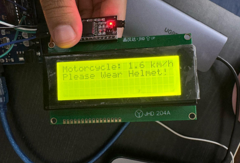

# Niveditha's Portfolio

A modern, cyberpunk-inspired personal portfolio website to showcase my projects, experience, and technical skills.

## 🚀 Description
This is my personal portfolio website, designed to highlight my journey as a computer science student and developer. It features a dynamic project showcase, a visually engaging About Me section, a technical skills overview, and a contact form. The site is fully responsive and built with HTML, CSS, and JavaScript.

## ✨ Features
- Animated cyberpunk theme with video and glitch effects
- Project showcase with live demo and GitHub links
- Timeline of experience
- Technical skills section (languages, frameworks, tools, databases)
- Modern, responsive layout
- Contact form (easy to integrate with Formspree or EmailJS)

## 🖼️ Screenshots
<!-- Replace with your own screenshots -->
| Home | Projects | About |
|------|----------|-------|
|  |  |  |

## 🛠️ Setup & Usage
1. Clone this repository:
   ```bash
   git clone https://github.com/yourusername/your-portfolio.git
   cd your-portfolio
   ```
2. Open `index.html` in your browser to view locally.
3. To deploy, upload the files to Netlify, Vercel, or GitHub Pages.
4. (Optional) Set up your contact form with [Formspree](https://formspree.io/) or [EmailJS](https://www.emailjs.com/).

## 📁 File Structure
- `index.html` — Main HTML file
- `styles.css` — All custom styles
- `script.js` — JavaScript for interactivity
- `project*.png` — Project images
- `header.gif`, `background.mp4` — Visual assets

## 👤 Author
**Niveditha Reddy Anumandla**  
[LinkedIn](https://www.linkedin.com/in/niveditha-anumandla-5729a8309/) • [GitHub](https://github.com/nivwya) • [Email](mailto:nivi.anr1707@gmail.com)

## 📄 License
This project is open source and available under the [MIT License](LICENSE). 